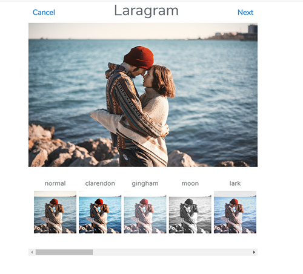
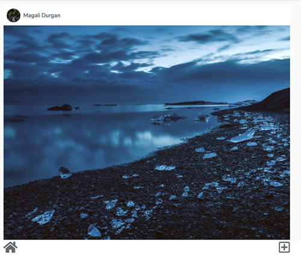

## Laragram





## Installation

### Prerequisites

* To run this project, you must have PHP 7 installed.
* You should setup a host on your web server for your local domain.


### Step 1

 Begin by cloning this repository to your machine, and installing all Composer & NPM dependencies.

```bash
git clone https://github.com/lupanvi/laragram.git
cd laragram
composer install && npm install
php artisan key:generate
php artisan migrate --seed
php artisan jwt:secret
npm run dev
```

### Step 2

Next, boot up a server and visit your laragram app. 

1. Visit: `http://your-laragram-url/login` and write the demo credentials:
	user: demo@gmail.com , password: 123456 , and press the login button
2. You will be redirected to the home page, where you can see and add pictures with filters
